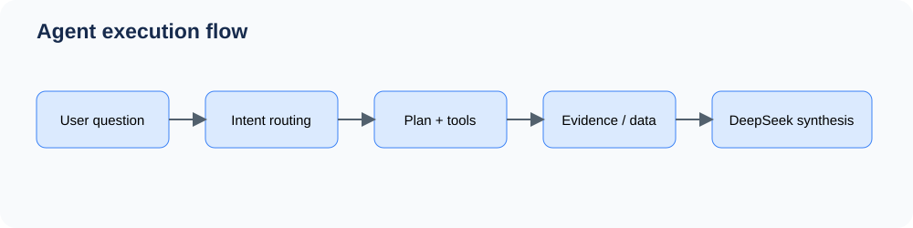
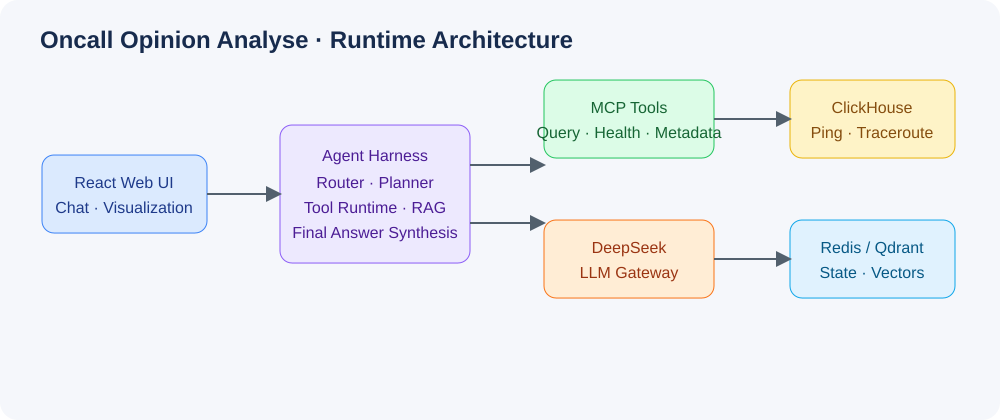
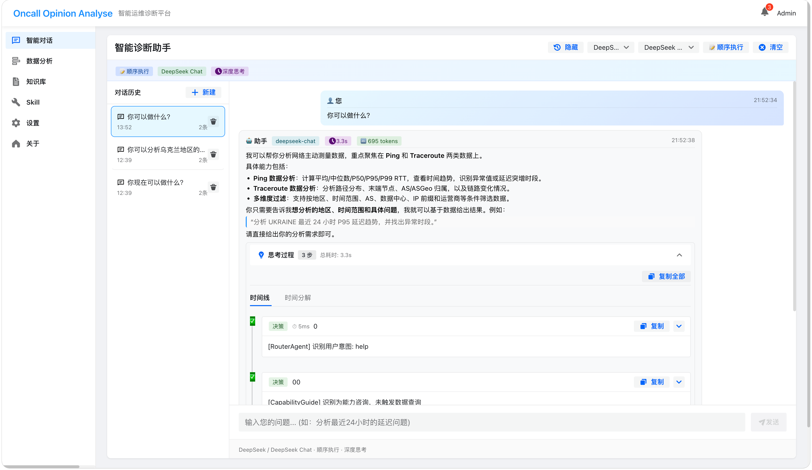
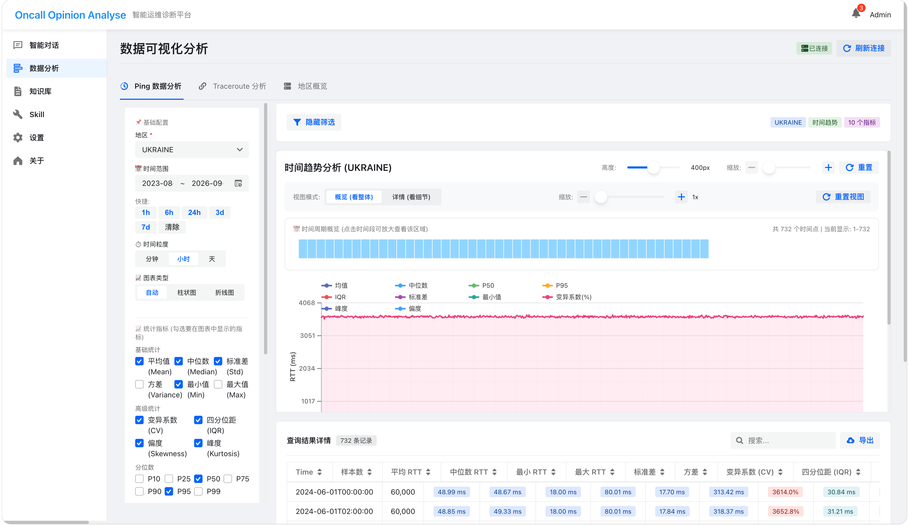
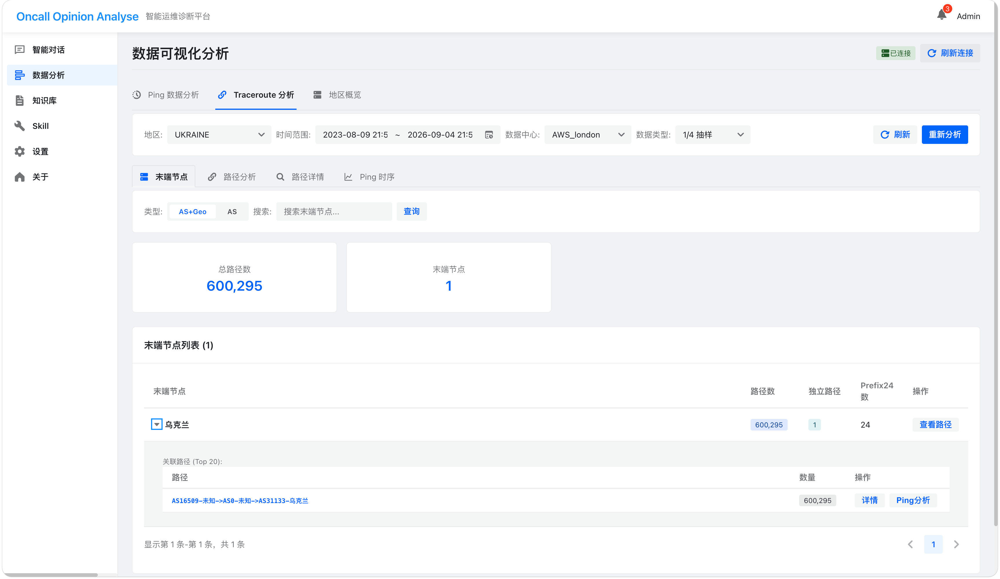

# Oncall Opinion Analyse

> 面向主动网络测量数据的 AI Agent 运维分析平台：让“自然语言问题 → 可验证证据 → 可视化结论”形成闭环。

[](https://www.python.org/) [](https://react.dev/) [](https://clickhouse.com/)

## 解决的问题

主动测量数据规模大、维度多且难解释。本项目把 Ping RTT、Traceroute 路径、AS/ASGeo、数据中心和运营商证据统一接入 Agent Harness：用户用自然语言提出地区、时间和指标问题，系统执行可追踪查询并返回带证据的可视化结论。工具失败原因和中间证据也会被记录，最终由 DeepSeek 基于事实重新组织答案，减少答非所问。

## 产品与架构





### 实际界面







前端通过 Nginx 访问 FastAPI/gRPC 服务；Agent Harness 负责意图识别、规划、MCP 工具调用、RAG 检索和最终回答生成；ClickHouse 保存测量数据，Redis 保存会话状态，Qdrant 保存知识向量。

## 核心能力

| 能力 | 说明 |
| --- | --- |
| 自然语言分析 | 将地区、时间、指标和筛选条件解析为可执行查询 |
| Ping 分析 | Mean/Median/P50/P95/P99、趋势、离群点和多维过滤 |
| Traceroute 分析 | 路径分布、末端节点、AS/ASGeo、链路变化 |
| Agent Harness | 路由、规划、工具运行时、超时/重试、审计和最终答案合成 |
| 可视化 | 趋势图、分位数图、路径详情和可滚动结果表 |
| 知识与 Skill | Qdrant RAG、可复用 Skill、执行轨迹和离线评测 |

## 目录结构

```text
├── frontend/              # React + Semi UI 前端
├── src/                   # Python Agent、API、ClickHouse、RAG、MCP
│   ├── agents/            # Harness 编排与最终答案生成
│   ├── api/               # FastAPI 路由
│   ├── clickhouse/        # 数据查询与连接管理
│   ├── mcp/               # 工具注册、重试、熔断、审计
│   ├── knowledge/         # 知识库与向量检索
│   └── eval/              # 评测、压测和回放
├── skills/                # network-telemetry 等领域 Skill
├── docker/                # Dockerfile、Compose、Nginx 配置
├── deploy/                # ClickHouse 初始化与部署脚本
├── docs/                  # 架构、部署、评测和设计文档
├── tests/                 # 单元与集成测试
├── biz/                   # Go 服务及 gRPC 相关代码
└── legacy/                # 历史版本，仅供迁移参考
```

## 本地启动

```bash
cp .env.example .env
# 在 .env 中填写 DEEPSEEK_API_KEY；不要提交 .env
docker compose -f docker/docker-compose.yml up -d
cd frontend && npm ci && npm run dev
```

默认地址：前端 `http://localhost:5173`，API 文档 `http://localhost:8000/docs`，健康检查 `http://localhost:8000/health`。

## 生产部署

完整步骤见 [部署指南](docs/DEPLOYMENT_GUIDE.md)。生产环境建议使用 Registry 中固定版本镜像；API Key 和数据库密码通过服务器环境变量或 Secret 注入；仅对外开放 80/443；ClickHouse、Redis、Qdrant 仅走 Docker 内网；通过 `/health`、健康检查和日志监控确认状态。

## 文档索引

- [Harness 架构](docs/HARNESS_ARCHITECTURE.md)
- [部署指南](docs/DEPLOYMENT_GUIDE.md)
- [评测与压测](docs/BENCHMARK_REPORT.md)
- [Skill 系统设计](docs/SKILL_SYSTEM_DESIGN.md)
- [MCP 工具集成](docs/mcp-tools-integration.md)

## 安全说明

`.env`、运行时数据、构建缓存和本地 IDE 配置均不应进入 Git。发布前执行 `git diff --check`，并检查是否存在误提交的 API Key 或密码。

## License

MIT
