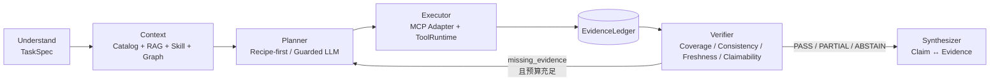

# Evidence-driven Agent Harness

本文档描述当前生产主链路。历史 Router/Reflection 图仅存在于兼容测试和旧模块中，不是 Chat API 的执行路径。

## 主链路



只有 `src/harness/graph.py` 驱动一次分析。`src/agents/service.py` 是协议兼容 Facade，不再拥有 Agent 编排权。

## 能力边界

- 高频网络分析使用 `src/harness/catalog.py` 中的预定义 Query Primitive；Planner 只能输出 `query_id + typed params`。
- 本地 Catalog 通过 `CatalogMCPAdapter` 进入统一 `ToolRuntime`，负责超时、重试、熔断、权限、输出限制和审计。
- 外部 MCP Server 由通用 `src/mcp/client.py` 管理。它与本地 Catalog 是两种 Capability Provider，不是两套 Harness。
- Query 结果先标准化为 Evidence，再由 Verifier 决定是否继续 Ping → ASN → Prefix24 → Traceroute 下钻。
- Knowledge、Skill 和 Neo4j 只能影响“去哪里找证据”，不能直接成为网络故障事实；最终事实必须绑定 ClickHouse/Traceroute Evidence。

## 恢复与可观测性

```text
ToolRuntime:
Schema → Permission → Idempotency → Deadline
       → Retry → Circuit Breaker → Handler
       → Output Limit → Audit / OpenTelemetry
```

Harness 生命周期持有一个 Catalog ToolRuntime，因此熔断和审计状态跨 Replan 轮次保留。Checkpoint 后端可通过 `AGENT_CHECKPOINT_BACKEND=redis` 切换到 Redis Stack；开发环境默认使用内存后端。

## 旧代码说明

`src/agents/langgraph/graph_builder.py` 及 `tests/test_harness_runtime.py` 保留用于旧协议/Runtime 回归兼容，标记为 Legacy；新增功能和面试演示应使用 `src/harness/` 及其四轮 Fake ClickHouse E2E 测试。
