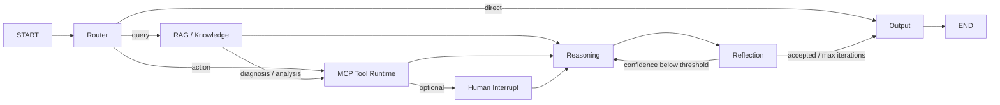

# Agent Harness Architecture

## Execution graph



The graph is a real LangGraph `StateGraph`, compiled with a Checkpointer. It exposes:

- `invoke`: synchronous entry point outside an event loop.
- `execute`: asynchronous entry point.
- `astream`: node-level streaming updates.
- `resume`: resumes a human interrupt or a persisted execution thread.

## Redis checkpoint and idempotency

Production uses Redis Stack because `langgraph-checkpoint-redis` requires RedisJSON and RediSearch. Plain Redis is sufficient for the idempotency ledger but not for the LangGraph checkpoint indexes.

Checkpoint state contains `AgentState`, the node cursor, pending writes and graph metadata. Side-effecting tools use a separate atomic Redis execution ledger keyed by `run_id:node:tool:operation`; graph recovery therefore does not re-run an already committed side effect.

Required production configuration:

```bash
export AGENT_CHECKPOINT_BACKEND=redis
export REDIS_URL=redis://localhost:6379/0
export AGENT_CHECKPOINT_PREFIX=oncall_agent
```

## Tool Runtime pipeline

```text
Registry → JSON Schema → Permission → Idempotency → Deadline
         → Classified Retry → Circuit Breaker → Handler
         → Output Limit → Audit Event → OpenTelemetry
```

Errors are classified as validation, permission, timeout, transient, permanent or circuit-open. Only timeout and transient failures are retried. Write and dangerous tools require the corresponding permission; side-effecting tools require an idempotency key.

## OpenTelemetry

The runtime creates spans for HTTP, gRPC, Agent runs, graph nodes, RAG retrieval, LLM generation, MCP calls and checkpoint setup/run/resume. Metrics record run count, tool count and run latency. Python logging records are bridged into the OTel Logs SDK.

When `OTEL_EXPORTER_OTLP_ENDPOINT` is set, all three signals use OTLP/gRPC. Without it, tests use in-memory exporters. The Compose monitoring profile includes an OTel Collector, Jaeger and Prometheus exporter configuration.

## Skill evolution

```text
Successful trace → Candidate extraction → Parameterization
→ Offline replay → Validated → Human approval → Published
→ New version → Regression gate → Rollback when needed
```

Generated Skills cannot publish themselves. Replay success thresholds and human approval are mandatory lifecycle gates.

## Evaluation

`HarnessEvaluator` records task success, tool success, recovery success, latency, input/output tokens, token cost and Skill regression status. `scripts/benchmark_harness.py` adds deterministic fault injection and concurrency measurements.

