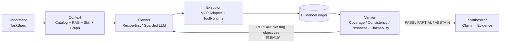

# Evidence-driven Agent Harness

本文档描述当前生产主链路。历史 Router/Reflection 图仅存在于兼容测试和旧模块中，不是 Chat API 的执行路径。

## 主链路



只有 `src/harness/graph.py` 驱动一次分析。`src/agents/service.py` 是协议兼容 Facade，不再拥有 Agent 编排权。

## 能力边界

- 高频网络分析使用 `src/harness/catalog.py` 中的预定义 Query Primitive；Planner 只能输出经过 Schema/Plan Guard 校验的 `query_id + typed params`。
- 长尾问题只能输出受控 `QueryIR`（`query.ir`），由白名单编译器生成绑定 SQL，禁止模型传入裸 SQL。
- Verifier 只输出可补证据的 objective/evidence_type，不输出下一步 query_id；Planner 根据目标、信息增益、成本和剩余预算选择动作。
- 本地 Catalog 通过 `CatalogMCPAdapter` 进入统一 `ToolRuntime`，负责超时、重试、熔断、权限、输出限制和审计。
- 外部 MCP Server 由通用 `src/mcp/client.py` 管理。它与本地 Catalog 是两种 Capability Provider，不是两套 Harness。
- Query 结果先标准化为 `MeasurementEvidence`，再由 Verifier 决定是否继续 Ping → ASN → Prefix24 → Traceroute 下钻。
- Knowledge、Skill 和 Neo4j 返回 `ContextEvidence`，只能影响“去哪里找证据”，不能直接成为网络故障事实；最终 Claim 必须绑定 `MeasurementEvidence`。
- 相关性 Claim 不能在 LLM 渲染阶段升级为“导致/根因”；程序级 Causality Guard 会拒绝这种输出并回退确定性文本。
- Verifier 生成 Verified Claims 后，LLM 仅负责把已批准的 Claim 渲染成人话；渲染失败则回退确定性文本。

## 恢复与可观测性

```text
ToolRuntime:
Schema → Permission → Idempotency → Deadline
       → Retry → Circuit Breaker → Handler
       → Output Limit → Audit / OpenTelemetry
```

Harness 生命周期持有一个 Catalog ToolRuntime，因此熔断和审计状态跨 Replan 轮次保留。Checkpoint 后端可通过 `AGENT_CHECKPOINT_BACKEND=redis` 切换到 Redis Stack；开发环境默认使用内存后端。

## Eval

`eval_data/network/` 提供不含敏感信息的可运行 replay seed；`src/eval/network_harness_eval.py` 统计 Task Success、Claim Recall、Evidence Coverage、Unsupported Claim Rate、Replan Success、LLM Calls/Tokens、跨证据一致性、平均轮数和查询数。`--react-policy llm` 才是正式 DeepSeek Free ReAct 对照，`deterministic` 仅用于低成本 smoke。它评估可重复的带标签 Case，不把没有独立标注支撑的结果伪装成线上准确率。

## 旧代码说明

`src/agents/langgraph/graph_builder.py` 及 `tests/test_harness_runtime.py` 保留用于旧协议/Runtime 回归兼容，标记为 Legacy；新增功能和面试演示应使用 `src/harness/` 及其四轮 Fake ClickHouse E2E 测试。
